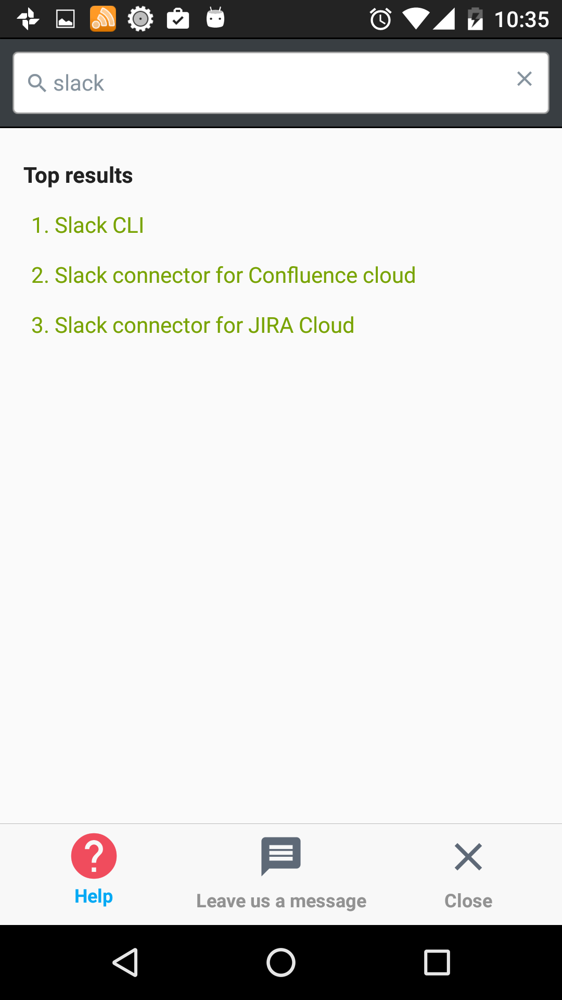
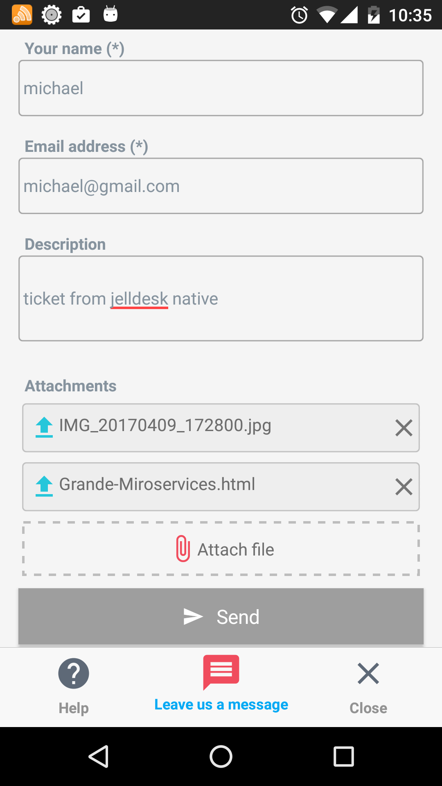
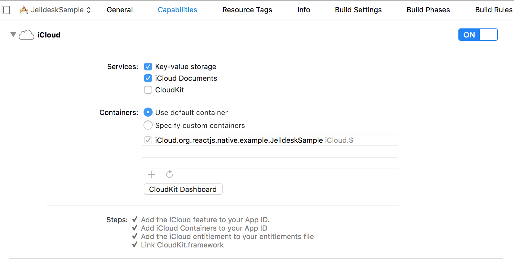

# react-native-jelldesk
A React Native module (support both IOS & Android) which includes UI and business code to allows you to integrate with [Embeddable for JIRA Service Desk](https://jsoftconnector.atlassian.net/wiki/display/JS/Embeddable+for+JIRA+Service+Desk) with minimal effort.

<p align="center">
 <a href="#"></a>
 <a href="#"></a>
</p>

## Demo
If you are eager to se how react-native-jelldesk looks like, please jump to JelldeskSample project. 

`npm install` and run the project on ios or android device.

## Install
`npm install react-native-jelldesk@latest --save`

## Dependencies configuration
1. react-native-vector-icons
Simply use: `react-native link react-native-vector-icons`

2. IOS - file picker
Currently we use [react-native-document-picker](https://github.com/Elyx0/react-native-document-picker) for file picker in IOS and its configuration is easy.
in your project type: `react-native link react-native-document-picker`

Don't forget to enable iCloud to on in xcode
<p align="center">
 <a href="#"></a>
</p>

3. Android - file picker
for android fil picke we use react-native-file-picker and it requires manual setup

### Android
```gradle
// file: android/settings.gradle
...

include ':react-native-file-picker'
project(':react-native-file-picker').projectDir = new File(settingsDir, '../node_modules/react-native-file-picker/android')
```
```gradle
// file: android/app/build.gradle
...

dependencies {
    ...
    compile project(':react-native-file-picker')
}
```
```xml
<!-- file: android/src/main/AndroidManifest.xml -->
<manifest xmlns:android="http://schemas.android.com/apk/res/android"
    package="com.myApp">

    <uses-permission android:name="android.permission.INTERNET" />

    <!-- add following permissions -->
    <uses-permission android:name="android.permission.CAMERA" />
    <uses-permission android:name="android.permission.WRITE_EXTERNAL_STORAGE"/>
    <uses-feature android:name="android.hardware.camera" android:required="true"/>
    <uses-feature android:name="android.hardware.camera.autofocus" />
    <!-- -->
    ...
```
```java
// file: MainApplication.java
...

import com.filepicker.FilePickerPackage; // import package

public class MainApplication extends Application implements ReactApplication {

   /**
   * A list of packages used by the app. If the app uses additional views
   * or modules besides the default ones, add more packages here.
   */
    @Override
    protected List<ReactPackage> getPackages() {
        return Arrays.<ReactPackage>asList(
            new MainReactPackage(),
            new FilePickerPackage() // Add package
        );
    }
...
}
```

## Usage
 Use it like so:
 When you want to display Jelldesk embeded widget:  
 **token**: token from Jira Service Desk  
 **projectKey**: Jira Service Desk project key  
 
```js
  import { JelldeskBox } from 'react-native-jelldesk';
  
  export default class JelldeskSample extends Component {
  render() {    
	    return (
	      <View style={styles.container}>
	        <Text style={styles.welcome}>
	          Welcome to React Native!
	        </Text>
	        <Text style={styles.instructions}>
	          To get started, edit index.android.js
	        </Text>
	        <Text style={styles.instructions}>
	          Double tap R on your keyboard to reload,{'\n'}
	          Shake or press menu button for dev menu
	        </Text>
    
       <JelldeskBox token={token} projectKey={projectkey} />
      </View>
    );
  }
}
```
